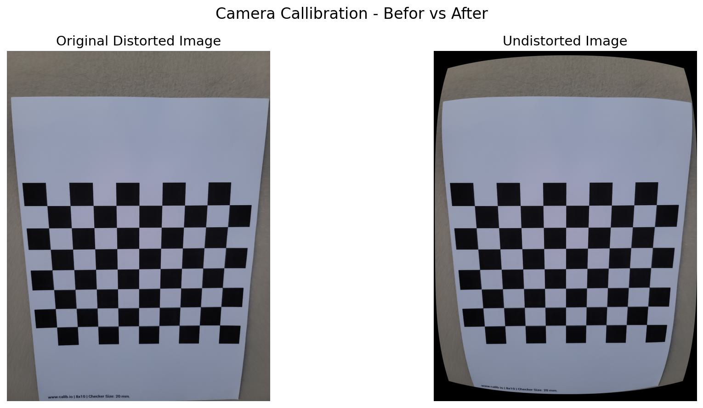

# Camera Calibration Report

### Overview

In this project, camera callibration is done to estimate parameters of the camera and correct the lens distortion before performing measurement tasks. Accurate calibration is important as it removes lens distortion from all the images because having distorted images can lead to incorrect pixel measurements and therefore inaccurate real-world measurements. 

### Methodology

camera calibration is performed using OpenCV checkerboard based calibration approach. 
A printed checkerboard pattern is used as calibration target. 50 images of checkerboard were captured in different lighting, angles, viewpoints and orientations to prvide geometrical variations for better parameter estimation.


The pipeline consisted of following steps:

1. Capturing checkerboard images that is printed with 9x7 inner-corner grid. 50 images captured from different angles and positions.
2. Convert Images to grayscale
3. Detect checkerboard corners using ` cv2.findChessbaordCorners() `
4. Refine corner loactions using `cv2.cornerSubPix()`
5. Use `cv2.calibrateCamera` on all image-point and obect-point pairs to solve for intrinsic matrix and distortion coefficients.
6. Compute reprojection error to evaluate calibration quality.
7. Save calibration parameters for later use during image undistortion and measurement.


## Calibration Dataset

| Parameter                    | Value |
| ---------------------------- | ----- |
| Total Calibration Images     |   50  |
| Successful Corner Detections |   50  |
| Failed Corner Detections     |   50  |

### Camera Parameters

**Camera Matrix**

The camera matrix `K` encodes the focal lengths and optical center.

``` 
K = [ fx 0  cx ]
    [ 0  fy cy ]
    [ 0  0  1  ] 
```

| Parameter | Symbol | Value (px) |
|-----------|--------|------------|
| Focal length X | fx | 3156.45 |
| Focal length Y | fy | 3158.69 |
| Principal point X | cx | 1492.42 |
| Principal point Y | cy | 1975.85 |

**Distortion Coefficients**

OpenCV models radial and tangential distortion.

``` distortion coefficents = [k1, k2, p1, p2, k3] ```

| Coefficient | Type | Value |
|-------------|------|-------|
| k1 | Radial (1st order) | 0.1155 |
| k2 | Radial (2nd order) | -1.0365 |
| p1 | Tangential | 0.0034 |
| p2 | Tangential | *-0.0039 |
| k3 | Radial (3rd order) | 2.5689 |

**Reprojection Error**

The difference between detected image points and the projected points obtained from the calibration model.

Value Obtained: 0.2089 px

Error < 0.3 px: Excellent calibration
Error < 0.5 px: Good calibration
Error > 0.5 px: Calibration should be improved. 

The obtained reproection error indicated excellent calibration.


### Image Undistortion

The estimated calibration parameters are use to undistort images using `cv2.undistort()` so that it removes radial and tangential lens distortion and produces geometrically corrected images.




## Script Reference

| Script | Purpose |
|--------|---------|
| `calibration/calibrate.py` | Detects corners, runs calibration, saves `.npz` |
| `calibration/undistort.py` | Verifies undistortion on a single test image |
| `calibration/undistort_dataset.py` | Batch undistorts all 100 dataset images |