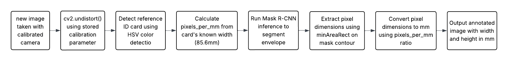
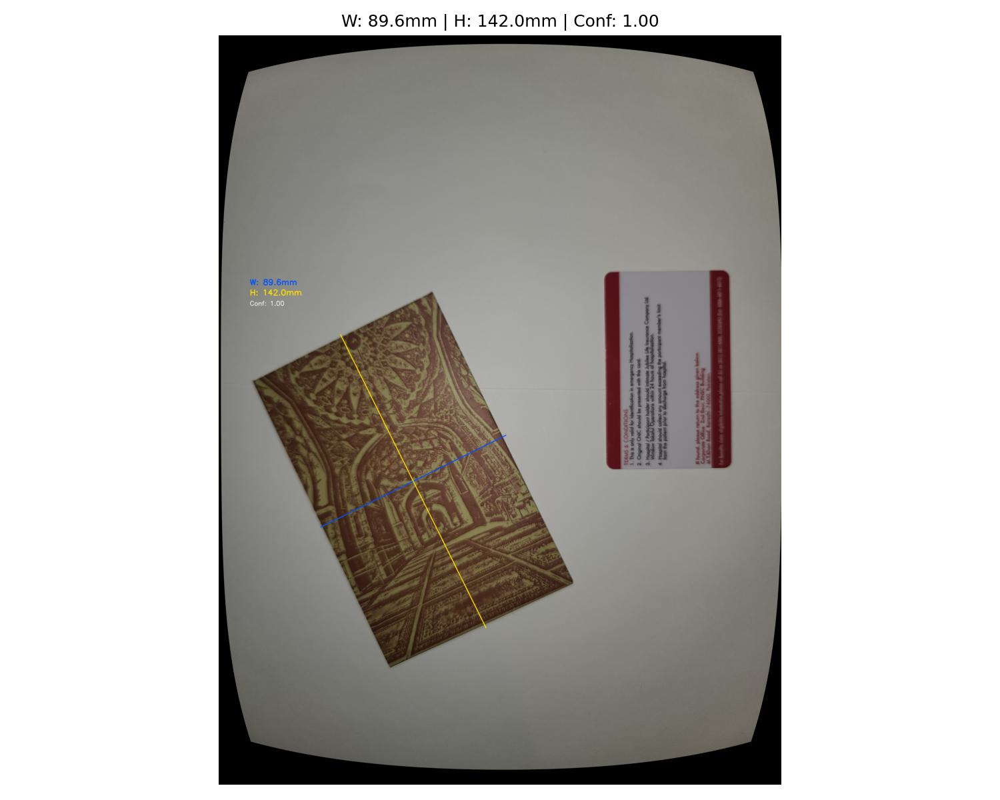
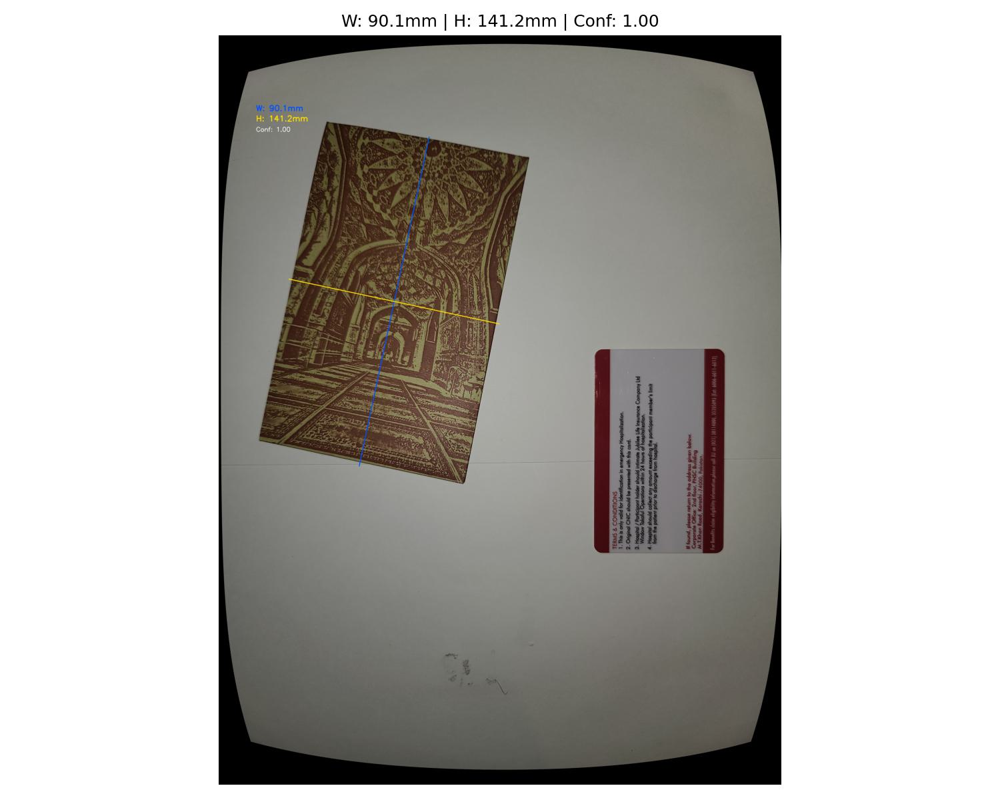

# Measurement Report

### Pipeline Overview

### Reference Object

| Property | Value |
|---|---|
| Object |ID card |
| Known width | 85.6mm (standard card size) |
| Known height | 54.0mm (standard card size) |
| Detection method | HSV color detection (red/maroon border) |
| Placement | Always visible in same frame as envelope |

### Undistorted Images

Raw distorted images produce incorrect measurements because lens distortion causes:
- Straight edges to appear curved
- Pixel distances to not correspond to real-world distances

All measurement images are undistorted with `cv2.undistort()` before any processing.

### Why minAreaRect Instead of Bounding Box

Standard axis-aligned bounding boxes give wrong dimensions when the envelope is rotated. `cv2.minAreaRect()` finds the tightest rotated rectangle around the segmentation mask contour, giving accurate width and height regardless of orientation.

## Ground Truth Envelope Dimensions
| Dimension | Value |
|---|---|
| Width | 90.0mm |
| Height | 139.0mm |

Measured with a physical ruler before testing.

## Accuracy Validation Results

| Image | Width (mm) | Height (mm) | W Error (mm) | H Error (mm) |
|---|---|---|---|---|
| 20260609_221307 | 93.47 | 146.74 | 3.47 | 7.74 |
| 20260609_221321 | 97.95 | 150.82 | 7.95 | 11.82 |
| 20260609_221330 | 97.27 | 153.97 | 7.27 | 14.97 |
| 20260609_221339 | 95.15 | 149.25 | 5.15 | 10.25 |
| 20260609_221412 | 91.36 | 141.22 | 1.36 | 2.22 |
| 20260609_221447 | 90.14 | 141.23 | 0.14 | 2.23 |
| 20260609_221457 | 90.10 | 142.79 | 0.10 | 3.79 |
| 20260609_221514 | 89.62 | 142.05 | 0.38 | 3.05 |

## Error Analysis

| Metric | Width | Height |
|---|---|---|
| Mean | 93.13mm | 146.01mm |
| Actual | 90.0mm | 139.0mm |
| MAE | 3.23mm | 7.01mm |
| MPE | 3.59% | 5.04% |

## Observations
- Images taken closer to the object (images 5-8) produced significantly better results
- Higher error in images 1-4 due to greater camera distance reducing pixel density

## Limitations
- Reference card must always be visible in the measurement photo
- Accuracy improves when camera is closer to the object
- System assumes flat surface photography
- Red/maroon color detection may be affected by similar colors in scene
- 

## Scripts
- `measurement/measurement.py` — complete measurement pipeline