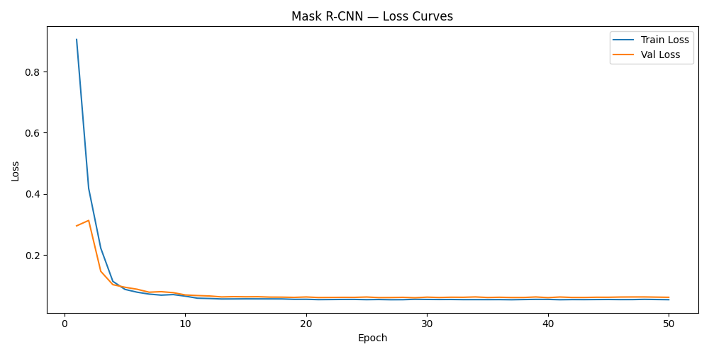

# Training Report
## (Mask RCNN Envelope Detection)

### Model Introduction

Mask R-CNN model with ResNet-50-FPN was used for instance segmentation of envelopes. 

- **Architecture:** Mask R-CNN (ResNet-50-FPN)

- **Task:** Envelope detection + segmentation

- **Framework:** PyTorch + Torchvision

### Training Setup

**Input resolution:** default (no resizing modification)

**Device:** CPU / GPU (as available)

### Why I Chose Mask RCNN

Mask R-CNN is used for object detection and segmentation. It provides a pixel level mask for each object so that it understands the shape. As pixel-to-mm calculation was required, Mask R-CNN could outline the exact shape of envelope using a mask and calculate width and height using that. It can also perform good on small datasets via transfer learning from COCO

### Training Objective

- Detect envelope location (bounding box)
- Generate accurate segmentation masks
- Generalize across different orientations and lighting conditions

### Hyperparametrs

| **Parameter** | **Value** |
|---------------|---------- |
| Epochs | 50 |
| Batch size| 2 |
| Learning rate | 0.005  |
| Weight decay | 0.0005 |
| LR scheduler | step=10, gamma=0.1 |
| Optimizer | SGD |
| Training device | GPU (google colab) |

### Dataset Used

| **Split** | **Images** |
|---------------|------- |
| Train | 70 |
| Validation| 20 |
| Test | 10  |

### Loss Curves

Loss dropped 94% from epoch 1 to epoch 50. Model converged and stabilized around epoch 13-15 with no overfitting (train ≈ val loss throughout).

### Evaluation Metric

| **Metric** | **Value** |
|---------------|------- |
| mAP@0.5 | 1 |
| mAP@0.5:0.95| 0.9723 |
| Mean IoU | 0.9570  |
| Precision| 1.000 |
| Recall | 1.000  |
| F1 score | 1.000  |
| Confidence score | ~0.999 |

## Model Files
- `models/maskrcnn_final.pth` — final trained model weights
- `models/loss_curves.png` — training and validation loss curves
- `models/evaluation_results.json` — saved evaluation metrics

## Scripts
- `models/train.py` — training script
- `models/evaluate.py` — evaluation script
- `models/plot_loss_curve.py` — loss curve visualization